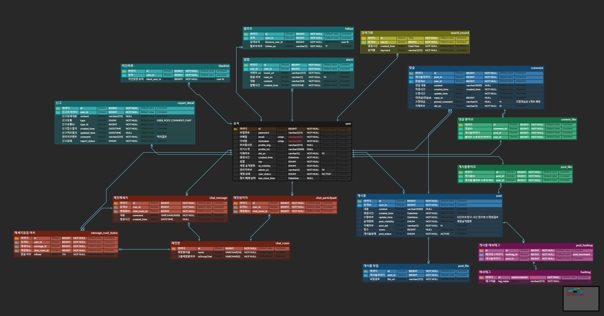

  

  <strong>Team TwinStar</strong>

|  |  |  |  |
| :---: | :---: | :---: | :---: |
| **팀장** 장기현 | **팀원** 이재석 | **팀원** 이준서 | **팀원** 이태희 |

 

## 🎮 기술 스택

**Backend**
 

 
 
 
**Frontend**
 

 
 
 
**Database**
 

 
 
 
**AWS**
 

 
 
 
**Ect Tool**
 

&nbsp;

 
 
 
## ✅프로젝트 개요  
 ### 1. 프로젝트 주제
 **[기본에 집중한 SNS 서비스]**   
  사용자들의 관심사와 취향을 중심으로 친밀하고 진정성 있는 관계 형성을 지원하는 맞춤형 소셜 네트워크 서비스(SNS)입니다. 트윈스타는 기존의 유명인 중심이나 표면적인 소통에서 벗어나 개인의 취향과 관심사에 맞는 콘텐츠를 공유하고, 이를 통해 의미 있고 깊이 있는 인간관계를 구축할 수 있는 플랫폼을 제공하는 것을 목표로 합니다. 즉, 트윈스타는 기존의 유명인 중심이나 표면적인 소통에서 벗어나 개인의 취향과 관심사에 맞는 콘텐츠를 공유하고, 이를 통해 의미 있고 깊이 있는 인간관계를 구축할 수 있는 플랫폼을 제공하는 것을 목표로 합니다. 맞춤형 콘텐츠 추천, 효과적인 해시태그 및 유저 검색, 그리고 유연한 개인정보 보호 기능을 통해 사용자들에게 더욱 편리하고 안전한 온라인 커뮤니티 환경을 제공하는 데 초점을 맞추고 있습니다.
  
 ### 2. 프로젝트 소개 
  트윈스타(Twinstar)는 사용자의 관심사와 취향을 중심으로 의미 있고 진정성 있는 소통과 관계 형성을 지원하는 차세대 맞춤형 소셜 네트워크 서비스(SNS)입니다. 기존의 SNS가 유명인이나 인플루언서 중심의 표면적이고 일방적인 소통에 머무르는 한계를 극복하고, 사용자들이 자신의 일상과 관심사를 보다 편안하게 공유하며 깊이 있는 관계를 형성할 수 있도록 기획되었습니다.
 
 
 
## ✏️ 기획

📝 요구사항 명세서

  
| 화면 | 구현 기능 | 작성자 | 설명 |
|------|-----------|------------|----------------------------------------------------------------------------------------------------|
| 🟩 **로그인** | 회원가입 | 🔵 **장기현** | 아이디(필수), 비밀번호(필수), 성별(필수),  닉네임 (중복검사, 필수) 입력 |
| 🟩 **로그인** | 자동 로그인 | 🔵 **장기현** | 이전에 로그인화면에서 자동로그인 팝업 체크 후 로그인할 경우,  이후 자동 로그인이 가능하다. |
| 🟩 **로그인** | 이메일 중복 체크 | 🟡 **이재석** | 회원가입 시 이메일 중복 체크한다. |
| 🟦 **프로필** | 개인 프로필 입력 | 🟡 **이재석** | 닉네임(필수, 중복X 변경O),  프로필사진(선택), 성별(필수) 입력 |
| 🟦 **프로필** | 프로필 사진 변경 가능 | 🟡 **이재석** | 프로필 사진은 jpg, jpeg, png 확장자만  업로드 가능하며, 비울 수 있다. |
| 🟦 **프로필** | 팔로우/팔로워 | 🟠 **이준서** | 회원이 팔로우한 목록, 팔로워 목록을 볼 수 있으며,  각자 인원수가 나타난다. |
| 🟦 **프로필** | 프로필 텍스트 변경 | 🟡 **이재석** | 프로필 내용을 변경할 수 있다. |
| 🟦 **프로필** | 계정 공개 범위 변경 | 🟡 **이재석** | 계정 공개 범위 변경 가능하다. |
| 🟦 **프로필** | 게시물 노출 | 🟡 **이재석** | 내가 올린 게시물들이 모여져 노출되어 있다. |
| 🟦 **프로필** | 게시물 로딩 | 🟡 **이재석** | 12개씩 보이며, 스크롤링할 때마다 추가적으로 로드된다. |
| 🟧 **게시글** | 게시글 작성 | 🔵 **장기현** | 사진, 동영상, 글을 작성할 수 있다.  해시태그 및 맞팔로워 태그가 가능하다. |
| 🟧 **게시글** | 게시물 게시일 | 🔵 **장기현** | 게시글 작성 시 1일전, 일주일전,  한 달전, 일년전과 같은 방식으로 나타난다. |
| 🟧 **게시글** | 게시물 범위 | 🔵 **장기현** | 게시자의 기준으로 게시물의 게시물 노출,  댓글달기 범위 설정 가능 |
| 🟧 **게시글** | 게시글 수정 | 🔵 **장기현** | 게시글을 수정할 수 있으며,  사진과 동영상은 수정 불가. 텍스트와 태그 수정 가능 |
| 🟧 **게시글** | 게시글 삭제 | 🔵 **장기현** | 게시글을 삭제할 수 있다. |
| 🟧 **게시글** | 게시글 좋아요 | 🔵 **장기현** | 게시글에 좋아요를 할 수 있으며,  좋아요 숫자 및 누가 눌렀는지 확인 가능 |
| 🟧 **게시글** | 게시글 더보기 | 🔵 **장기현** | 게시글 내용이 길어지면  더보기 버튼을 통해 전체 내용 확인 가능 |
| 🟧 **게시글** | 게시글 목록 | 🔵 **장기현** | 팔로우한 사람들의 게시물을  게시일시 기준 오름차순으로 볼 수 있다. |
| 🟥 **댓글** | 댓글 작성 | 🔵 **장기현** | 게시글에는 댓글을 작성할 수 있으며  맞팔로워는 태그가 가능하다. |
| 🟥 **댓글** | 댓글 게시일 | 🔵 **장기현** | 댓글 작성 시 1일전, 일주일전,  한 달전, 일년전과 같은 방식으로 나타난다. |
| 🟥 **댓글** | 댓글 나열 | 🔵 **장기현** | 작성일 기준 오래된 순으로 나열된다. |
| 🟥 **댓글** | 댓글 수정 | 🔵 **장기현** | 댓글을 수정할 수 있다. |
| 🟥 **댓글** | 댓글 삭제 | 🔵 **장기현** | 댓글을 삭제할 수 있으며,  삭제된 댓글입니다.로 표시된다. |
| 🟥 **댓글** | 댓글 좋아요 | 🔵 **장기현** | 댓글에 좋아요를 할 수 있으며,  좋아요 숫자 및 누가 눌렀는지 확인 가능 |
| 🟪 **채팅** | 메시지 보내기 | 🔵 **장기현** | 유저는 다른 유저에게 메시지를 보낼 수 있다. |
| 🟪 **채팅** | 메시지 받기 | 🔵 **장기현** | 유저는 다른 유저에게 메시지를 받을 수 있다. |
| 🟪 **채팅** | 그룹채팅방 | 🔵 **장기현** | 그룹 채팅방을 개설하여  여러 유저와 메시지를 주고받을 수 있다. |
| 🟪 **채팅** | 메시지 시각 | 🔵 **장기현** | 보내거나 받은 메시지의 시간을 알 수 있다. |
| 🟨 **이슈** | 팔로우 알림 | 🔵 **장기현** | 누군가 팔로우를 할 경우 알림이 온다. |
| 🟨 **이슈** | 댓글 작성 알림 | 🔵 **장기현** | 내 게시글에 댓글이 작성될 경우 알림이 온다. |
| 🟨 **이슈** | 대댓글 작성 알림 | 🔵 **장기현** | 내 댓글에 대댓글이 작성될 경우 알림이 온다. |
| 🟨 **이슈** | 좋아요 알림 | 🔵 **장기현** | 내 댓글 또는 게시글에 좋아요를 누르면 알림이 온다. |
| 🟦 **관리자** | 관리자 유저검색 | 🟡 **이재석** | 닉네임으로 유저 검색 가능 |
| 🟦 **관리자** | 유저 상세 조회 | 🟡 **이재석** | 유저의 정지일, 계정 삭제 여부 등의 상세 정보를 조회 |
| 🟦 **관리자** | 관리자 권한 부여 및 회수 | 🟡 **이재석** | 관리자가 유저에게  관리자 권한 부여 및 회수 가능 |
| 🟦 **관리자** | 관리자 계정 정지 | 🟡 **이재석** | 계정 정지가 가능하며 정지 기간을 설정할 수 있음 |
| 🟩 **검색** | 닉네임 검색 | 🟡 **이재석** | 닉네임을 입력하면  해당 유저와 비슷하거나 일치하는 유저를 검색 가능 |
| 🏿 **기타** | 유저 간 차단 | 🟡 **이재석** | 유저 A가 유저 B를 차단하면  해당 게시물 및 댓글, 프로필을 볼 수 없음 |
| 🏿 **기타** | 팔로우 요청 | 🟠 **이준서** | 유저 간 팔로우 요청이 가능하다. |
| 🏿 **기타** | 회원탈퇴 | 🟡 **이재석** | 회원탈퇴 기능 |

🗓️ WBS

 

📌 ERD

 

---

## ⚙️ 시스템 아키텍처

 

## 🖥️ UX/UX 단위테스트
### 👤유저 관련 기능

회원가입

- 이메일 형식 및 중복 이메일 검증
- 비밀번호 검증 및 비밀번호 재확인
- 닉네임 중복 검증

로그인

유저 검색

- 유저검색 후 프로필 이동

프로필 편집

- 프로필사진 변경
- 프로필 텍스트 변경

팔로워 & 팔로잉 리스트

 

### 📝 게시물 기능

개인 프로필에서 상세페이지 조회

- 개인 프로필 게시물 댓글 및 좋아요 수 보기
- 게시물 상세 조회

게시물 작성

- 파일 드래그앤드랍 가능
- 해시태그 입력
- 계정 공개범위 입력

게시물 수정 및 삭제

게시물 좋아요

- 게시물 좋아요 기능
- 게시물 좋아요 리스트

게시물 댓글 및 댓글 좋아요

- 댓글 작성
- 댓글 좋아요
- 댓글 좋아요 리스트

대댓글 작성 및 대댓글 좋아요, 답글 토글

대댓글 삭제

게시물 상단 팔로우 버튼

무한 스크롤링

무한 스크롤링을 통해 사용자 경험을 개선하고, 페이지네이션 없이 연속적으로 콘텐츠를 로드할 수 있습니다.

 

### 🔔 알림 기능

알림 텍스트를 클릭하면 해당 알림 내용에 맞는 페이지로 이동

- 채팅
- 게시물 좋아요, 댓글 등
- 팔로우

구글 알림팝업

 

### 🗨️ 채팅

실시간 채팅

그룹채팅

방제목 변경

채팅방 참여자 유저 목록

채팅방 삭제

 

### 🔧관리자

유저 관리 - 닉네임 검색

유저 관리 - 관리자 권한

설명이 필요하면 여기에 추가하세요.

계정 정지

 

## 💬 팀 회고 - 기술적 경험 정리
|팀원|회고 내용|
|:---:|-|
|장기현| WebSocket(STOMP)를 사용하여 실시간 1:1 채팅 및 그룹 채팅을 구현했지만, 다중 서버 환경에서는 WebSocket 세션이 서버 간 공유되지 않기 때문에 Redis Pub/Sub을 이용한 확장이 필요했습니다. 이를 적용하는 과정에서 세션 정보 동기화 문제와 메시지 유실 방지 방안을 고민해야 했지만, 결국 Redis를 활용한 메시지 브로드캐스팅을 통해 다중 서버에서도 안정적으로 동작하도록 개선할 수 있었습니다.   또한, 좋아요 기능에서는 Redis를 활용하여 캐싱 및 비동기 처리 방식으로 성능을 최적화했습니다. 처음에는 좋아요 요청이 직접 DB에 반영되었으나, 트래픽 증가로 인해 부하가 발생할 가능성이 있었는데요, 이를 해결하기 위해 좋아요 데이터를 Redis에 먼저 저장하고, 이후에 DB에 반영하는 방식을 적용하여 실시간 반영이 가능하도록 개선했습니다.   알림 서비스의 경우, 처음에는 WebSocket을 사용할 계획이었으나, 단방향 메시지 전송이 주를 이루는 알림 시스템에는 SSE(Server-Sent Events)가 더 적합하다고 판단하여, SSE를 활용하면 WebSocket처럼 불필요한 연결 유지 비용 없이 클라이언트가 서버로부터 실시간 이벤트를 받을 수 있기 때문에 서버 리소스를 절약하면서도 안정적으로 알림을 전송할 수 있도록 구현했습니다.   이번 경험을 통해 WebSocket과 SSE의 적절한 활용 방식, Redis를 이용한 성능 최적화 및 확장성 확보, 비동기 이벤트 처리 방식의 중요성을 배울 수 있었습니다. 다만, WebSocket을 다중 서버 환경에서 확장하는 과정이 쉽지 않았고, 다음번에는 WebSocket과 SSE를 혼합하여 더 유연한 실시간 시스템을 구축하고, Redis 사용 시 데이터 정리 전략을 명확히 수립하는 것이 필요하다고 느꼈습니다.   팀원분들 다들 고생하셨습니다 :) |
|이재석| 학원에서 배웠던 기본 CRUD를 이해하는 시간이 되었습니다.유저기능 중 프로필 CRUD 개발 중 프로필 이미지를 MultipartFile로 받아 AWS S3 업로드 후 URL을 DB에 저장했습니다.이미지를 저장하지 않으면 기본이미지를 설정해놔 UI에서 예외 상황 방지했습니다.  Specification을 활용한 동적 검색 기능 구현을 했습니다. 유저검색은 닉네임을, 해시태그는 해당 단어를 기준으로 LIKE검색에서 %를 사용하여 부분 일치 검색 개선을 하였고 대소문자 구분 문제를 해결하기 위해 LOWER()함수를 적용했습니다. 관리자가 특정 사용자를 신고하거나 정지할 수 있는 기능을 구현했습니다.   정지된 계정은 일정 기간이 지나면 자동으로 복구되도록 했습니다.동일한 사용자를 중복 신고하는 문제를 방지하기 위한 로직을 추가하고 계정 정지 해제 프로세스에서 LocalDateTime을 활용하여 현재 시간과 비교하는 방식으로 자동해제 기능을 구현했습니다. 하지만 수동으로 정지와 해제는 할 수 있는데 스케줄러 기능이 구현이 안되어 개선하도록 하겠습니다.  개선할 점으론 계정 정지 기능에서 정지된 사용자에게 알림을 보낼 수 있는 기능 추가와 프로필 검색 속도 최적화를 위해 캐싱 도입 및 자동완성을 추가해보려고 합니다.  마지막으로 이번 프로젝트로 웹사이트의 흐름을 이해하는 시간이 되었습니다. http요청에서 get요청하면 body에 데이터가 들어오고 그 데이터로 유저 조회나 팔로우를 걸 때 검증하는 데이터를 줄 수 있다는 사실을 알았습니다. 그래서 기획할 때 정확한 dto를 설정하는 것이 중요하고 어떤 기능을 만들지 고민 후 어떤 데이터가 어떻게 흐르는지 고민해보는 시간이었습니다.  |
|이준서|  |
|이태희|  |
